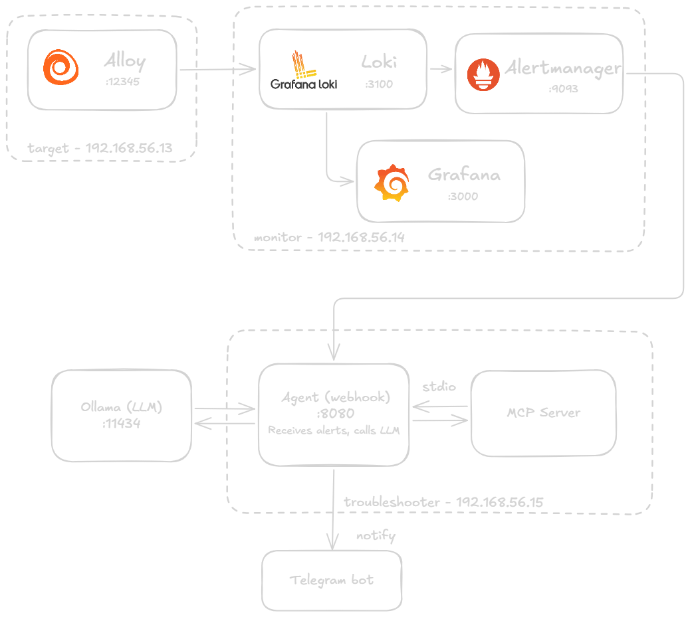

# LLM Initial Troubleshooting

A proof-of-concept system for **automated initial troubleshooting of failed Linux systemd services** using LLM analysis. When a service fails on a monitored host, the pipeline automatically collects logs, analyzes them with a local LLM, and delivers a structured diagnosis with investigation steps — all without human intervention.

## Architecture



## Pipeline

```
Alloy → Loki → Alertmanager → Agent (MCP Client) → MCP Server
```

1. **Alloy** collects systemd journal entries (error level and above) from the target host and ships them to Loki.
2. **Loki** aggregates logs and evaluates alert rules. When critical log activity is detected, it fires an alert to Alertmanager.
3. **Alertmanager** groups alerts by hostname and routes them via webhook to the Agent.
4. **Agent** (MCP Client) receives the webhook, creates an incident record, and invokes MCP Server tools to gather forensic data via SSH.
5. **MCP Server** SSHes into the target host, retrieves failed services (`systemctl`) and their logs (`journalctl`).
6. The Agent sends the collected logs to a local **Ollama** LLM instance for analysis.
7. The analysis (root cause, investigation steps, possible causes) is stored in SQLite and a **Telegram** notification is sent with a link to the incident UI.

## Infrastructure

Three Vagrant VMs on a private network (`192.168.56.0/24`), provisioned automatically with shell scripts:

| VM | Hostname | IP | Resources | Services |
|----|----------|----|-----------|----------|
| target | target.concept.lab | 192.168.56.13 | 1 CPU / 1 GB | Alloy |
| monitor | monitor.concept.lab | 192.168.56.14 | 2 CPU / 2 GB | Loki, Alertmanager, Grafana |
| troubleshooter | troubleshooter.concept.lab | 192.168.56.15 | 2 CPU / 4 GB | Agent, MCP Server, Docker, Gitea |

## Components

### Alloy (target VM — port 12345)
Grafana Alloy reads the systemd journal and filters log entries at `err`, `crit`, `alert`, and `emerg` priority levels. Logs are labelled and pushed to Loki.

### Loki (monitor VM — port 3100)
Stores logs and evaluates the `CriticalLogDetected` alert rule:
```
sum by (host) (count_over_time({job="journald", level=~"err|crit|alert|emerg"}[1m])) > 0
```
Rule is evaluated every 15 seconds. On match, an alert fires to Alertmanager.

### Alertmanager (monitor VM — port 9093)
Groups alerts by hostname with a 30-second group wait and routes them as HTTP webhooks to the Agent at `http://192.168.56.15:8080/alert`.

### Grafana (monitor VM — port 3000)
Provides a dashboard for manual log exploration using Loki as a datasource.

### Agent + MCP Server (troubleshooter VM — port 8080)
A FastAPI webhook receiver (MCP Client) paired with a FastMCP server. Together they collect forensic data from the target host via SSH, run LLM analysis through Ollama, persist incidents in SQLite, serve a web UI, and send Telegram notifications.

See [vagrant/trblsh/README.md](vagrant/trblsh/README.md) for full details: API endpoints, MCP tools, database schema, LLM prompt and output format, configuration reference, and known limitations.

### Ollama (external)
A local Ollama instance (default: `http://192.168.0.88:11434`) serves the `qwen2.5:3b` model. The address is configurable in the Agent's environment. Any Ollama-compatible model can be substituted.

## Prerequisites

- [Vagrant](https://www.vagrantup.com/) with [VirtualBox](https://www.virtualbox.org/)
- Ollama running locally with a supported model pulled (e.g. `ollama pull qwen2.5:3b`)
- A Telegram bot token and chat ID for notifications

## Setup

### 1. Clone and start VMs

```bash
git clone <repo-url>
cd llm-init-trblsh
vagrant up
```

All three VMs are provisioned automatically. This installs and configures Alloy, Loki, Alertmanager, Grafana, Docker, Gitea, and the Docker registry.

### 2. Configure Alertmanager webhook

Update `/etc/alertmanager/alertmanager.yml` on the monitor VM to point to the Agent:

```yaml
receivers:
  - name: webhook
    webhook_configs:
      - url: "http://192.168.56.15:8080/alert"
```

Restart Alertmanager after the change:
```bash
sudo systemctl restart alertmanager
```

### 3. Set up and start the Agent

See [vagrant/trblsh/README.md](vagrant/trblsh/README.md) for SSH key setup, environment configuration, installation, and how to start the Agent.

The web UI is available at `http://192.168.56.15:8080`.

## Testing

A dummy failing service and a helper script are provided on the target VM:

```bash
vagrant ssh target
bash /vagrant/target/create_event.sh
```

This starts `dummy-fail.service`, which immediately fails and produces error-level journal entries. Within ~1 minute the alert fires and the Agent processes the incident. Check the UI or your Telegram chat for the result.

## Project Structure

```
.
├── Vagrantfile                        # VM definitions (3 VMs)
├── scripts/                           # Provisioning shell scripts
│   ├── add-hosts.sh
│   ├── install-and-setup-alloy.sh
│   ├── install-and-setup-loki.sh
│   ├── install-and-setup-alertmanager.sh
│   ├── install-and-setup-grafana.sh
│   ├── install-docker.sh
│   ├── install-docker-registry.sh
│   ├── install-gitea.sh
│   └── setup-gitea.sh
└── vagrant/
    ├── gitea/
    │   └── gitea-compose.yaml         # Gitea + MySQL Docker Compose
    ├── target/
    │   ├── dummy-fail.service         # Systemd service that always fails (test)
    │   └── create_event.sh            # Script to trigger a test failure event
    └── trblsh/
        ├── agent.py                   # MCP Client + FastAPI webhook handler
        ├── server.py                  # MCP Server (SSH tools)
        ├── requirements.txt
        ├── .env.example
        ├── ignore_list.txt            # Services to exclude from analysis
        └── templates/
            ├── home.html              # Incident list UI
            └── alert.html             # Incident detail UI
```

## Configuration Reference

| Setting | Location | Default | Description |
|---------|----------|---------|-------------|
| Alert group wait | `alertmanager.yml` | 30s | Delay before first alert fires |
| Alert repeat interval | `alertmanager.yml` | 2m | Interval for repeat alerts |
| Loki rule evaluation | `journald-logs.yaml` | 15s | How often alert rule is checked |

For Agent and MCP Server configuration (Ollama URL, model, SSH key, Telegram credentials, ignore list) see [vagrant/trblsh/README.md](vagrant/trblsh/README.md).
